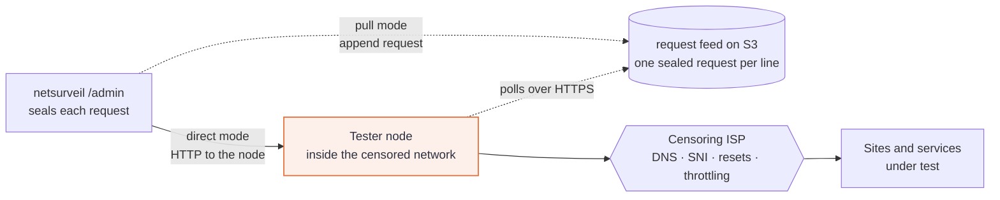
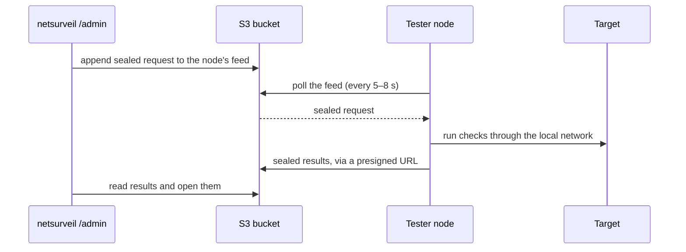
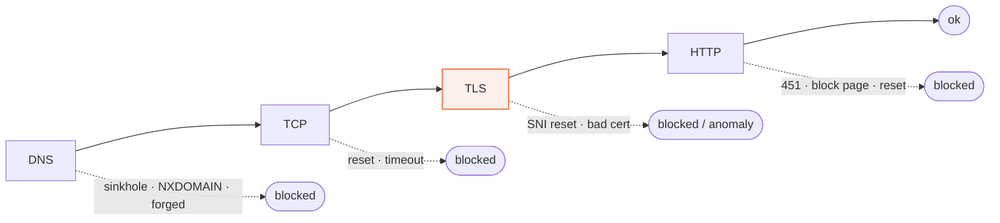

# NetSurveil tester node

[](https://github.com/the-dot-squad/netsurveil-tester/actions/workflows/ci.yml)
[](https://github.com/the-dot-squad/netsurveil-tester/releases/latest)
[](https://github.com/the-dot-squad/netsurveil-tester/pkgs/container/netsurveil-tester)
[](go.mod)
[](https://pkg.go.dev/github.com/the-dot-squad/netsurveil-tester)
[](https://goreportcard.com/report/github.com/the-dot-squad/netsurveil-tester)
[](LICENSE)

A small, self-contained agent that measures internet censorship from inside the
network being censored. You place a node on a connection in the country or ISP
you want to observe. The netsurveil website then asks it to test sites and
services. The node reports what happened and how: a DNS
sinkhole, a TCP reset on the SNI, a dropped QUIC handshake, bandwidth
throttling, and so on.

Every request and result is end-to-end encrypted with a per-node key. A node
that receives anything it cannot authenticate answers with an empty `404`, the
same as any closed web server.

## How it works



A node is hybrid: it always takes direct requests, and also pulls requests
from a feed when one is configured.

- **Direct.** The node listens on HTTP and the website calls it. This works
  whenever the website can reach the node, and it supports live progress and
  cancellation.
- **Pull.** The node polls a text file on S3 that holds one sealed request
  per line, and uploads each sealed result to a presigned S3 URL carried
  inside the request; it never contacts the website. Blocking it means
  blocking a whole regional S3 endpoint, and several mirror URLs can be
  listed. This reaches nodes behind NAT and on mobile links.

In both modes the website and the storage in between only handle ciphertext.
A request is valid for two minutes and can be used once; anything else is
dropped silently.



## What it checks

| Check        | What it tells you |
|--------------|-------------------|
| `web`        | Loads a URL stage by stage (DNS, TCP, TLS, HTTP) and names the stage that failed |
| `dns`        | Compares the local resolver with clean resolvers and DoH; spots sinkholes, NXDOMAIN hijacks and forged answers |
| `tcp`        | Open, reset, refused or silently dropped, port by port |
| `sni`        | Whether a TLS handshake dies because of the server name alone |
| `quic`       | Whether HTTP/3 is blocked while TCP still works |
| `ping`, `traceroute` | Packet loss, ICMP filtering, and the hop where traffic stops |
| `throttle`   | Download speed against a control download; detects bandwidth caps and stall-after-N-bytes |
| `info`       | The node's public IP, location, network operator and resolvers, which tell you which network it is really measuring |

Every result carries a **verdict** (`ok`, `blocked`, `throttled`, `anomaly`,
`unreachable` or `error`), a **mechanism** such as `dns_sinkhole` or
`tls_sni_rst`, per-stage timings, and the raw evidence behind the conclusion.
For example, a `web` check reaches its verdict like this:



Where it can, a check runs control measurements (clean resolvers, a neutral
server name, a reference download) to tell censorship apart from an outage.
Failures it cannot attribute are reported as `unreachable` or `anomaly`.
Comparing the same check across several nodes, including one outside the
censored network, gives the strongest signal.

## Quick start

Each node has its own shared secret, which the node and the website both hold.

**With Docker** (recommended):

```sh
cp .env.example .env    # set NODE_ID, NODE_SECRET (openssl rand -base64 32), FEED_URLS
docker compose up -d
```

`docker-compose.yml` runs the published image
`ghcr.io/the-dot-squad/netsurveil-tester`, pinned to the release it ships with,
publishes direct requests on `NODE_PORT` (default 8080), and pulls the feed
when `FEED_URLS` is set. Take `docker-compose.yml` from the
[latest release](https://github.com/the-dot-squad/netsurveil-tester/releases/latest)
to upgrade.

**Without Docker**, as a systemd service on a Linux (amd64 or arm64) host:

```sh
curl -fsSL https://github.com/the-dot-squad/netsurveil-tester/releases/latest/download/install.sh | sudo sh
```

The installer downloads the release binary and verifies its checksum. It
writes `/etc/netsurveil-tester/node.env` with a newly generated secret (shown
once, so you can register it on the website) and starts a hardened
`netsurveil-tester` service. Run it again to upgrade, or with `--uninstall`
to remove the service.

Then register the node, its address and its secret on the website, and run
checks from there.

## Staying low-profile

A node runs on a network whose operator may be looking for it, so it is built
to blend in:

- It never contacts the website. Pulling adds only an HTTPS poll to a
  regional S3 endpoint, with randomized timing.
- Every unauthenticated request gets an empty `404`, with no banner, default
  error page or reachable health endpoint. Use a random path prefix as well.
  The envelopes are encrypted, but plain HTTP still shows the ISP that the
  endpoint exists; to hide that, put a TLS reverse proxy (such as Caddy) in
  front of the node.
- HTTP probes use a normal browser `User-Agent`. Port checks are paced so they
  don't look like a scan. Probes with a known measurement signature are
  opt-in.
- The container (or the systemd service) is read-only, with every capability
  dropped except raw sockets for ping and traceroute. It keeps no state on disk, and
  its logs never contain targets or results.
- The test suite runs on a sealed Docker network. Running it on a node host
  generates no outside traffic.

The details, and the trade-offs of the noisier checks, are in
[OPERATIONS.md](docs/OPERATIONS.md#3-low-profile-operation).

## Development

```sh
make test    # unit tests with the race detector
make vet     # go vet, including the e2e build tag
make lint    # golangci-lint (.golangci.yml)
make cover   # tests with a coverage floor (COVER_MIN)
make fuzz    # short fuzzing of every parser of untrusted input (FUZZTIME)
make vuln    # govulncheck
make ci      # vet, lint, test, cover, vuln and build, as CI runs them
make docker  # local image; PUSH=1 builds and pushes linux/amd64 and linux/arm64
make e2e     # full censorship simulation in Docker
```

`make e2e` builds a small censored network: a lying DNS resolver, a target
server, and an iptables/tc "ISP" that resets, drops and throttles traffic. It
then checks that every check type reports the exact verdict and mechanism, in
both direct and pull mode. The node under test extends the production
`docker-compose.yml` service, so it runs with the same hardening.

CI (`.github/workflows/ci.yml`) runs lint, race tests with the coverage floor,
govulncheck, fuzzing, shellcheck on `install.sh`, linux/amd64 and
linux/arm64 builds, a multi-arch image build and the e2e suite on every pull
request.

## Releasing

Releases are automated with [release-please](https://github.com/googleapis/release-please).
PR titles must follow [Conventional Commits](https://www.conventionalcommits.org/)
(`feat:`, `fix:`, `docs:` and so on). CI checks this, and the titles become
the changelog. After each merge to `main`, release-please updates an open
release PR with the next version, the `CHANGELOG.md` entry, and the image tag
in `docker-compose.yml`. Merging that PR tags the release, and
`.github/workflows/release.yml` then:

- pushes `ghcr.io/the-dot-squad/netsurveil-tester:<version>`, `:<major>.<minor>` and
  `:latest` for linux/amd64 and linux/arm64, with an SBOM and build provenance,
  signed keylessly with cosign;
- attaches `nst-node` archives for linux/amd64 and linux/arm64, `SHA256SUMS`,
  `install.sh`, `docker-compose.yml` and `.env.example` to the GitHub release.

Verify an image with:

```sh
cosign verify ghcr.io/the-dot-squad/netsurveil-tester:<version> \
  --certificate-identity-regexp 'https://github.com/the-dot-squad/netsurveil-tester/' \
  --certificate-oidc-issuer https://token.actions.githubusercontent.com
```

release-please needs **Settings → Actions → General → Allow GitHub Actions to
create and approve pull requests** enabled.
Release PRs opened with the default `GITHUB_TOKEN` do not trigger CI. To get
CI on them, add a `RELEASE_PLEASE_TOKEN` repository secret holding a
fine-grained token with contents and pull-request write access.

## Documentation

- [Protocol](docs/PROTOCOL.md): the encrypted envelope, both transports, the
  result format and every check option. Start here to build another client.
- [Admin integration](docs/ADMIN_INTEGRATION.md): the database schema,
  TypeScript envelope code, the submit and poll flows, and how to compare
  nodes.
- [Pull mode over S3](docs/S3_FEED.md): the bucket setup, path-style mirror
  URLs, and the website module that writes feeds and reads results.
- [Operations](docs/OPERATIONS.md): deployment, configuration, hardening,
  low-profile operation and troubleshooting.

## Contributing

Bug reports, new checks and documentation fixes are welcome. Read
[CONTRIBUTING.md](CONTRIBUTING.md) for the setup, the rules that keep nodes
low-profile, and the pull request conventions. For questions or ideas, open an
[issue](https://github.com/the-dot-squad/netsurveil-tester/issues).

Never post real node IDs, secrets, addresses or locations in issues or pull
requests.

## Security

Report vulnerabilities privately, as described in [SECURITY.md](SECURITY.md),
and not in public issues.

## License

Copyright (C) 2026 Payam Foundation and contributors.

NetSurveil tester is free software, released under the
[GNU Affero General Public License v3.0](LICENSE). If you run a modified
version as a network service, you must offer its source code to the users of
that service. It is developed and maintained by The Dot Squad for the Payam
Foundation.
