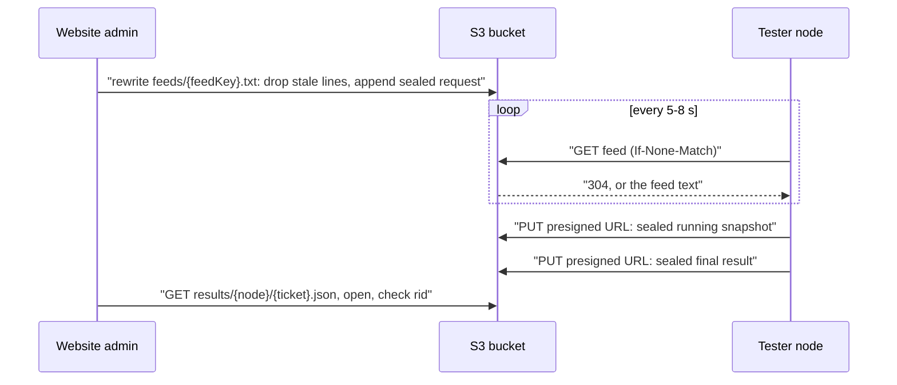

# Pull mode over S3

A pull-mode node opens no port and never contacts the netsurveil website. It
reads its requests from a plain text file on S3, one sealed request per line,
and it uploads each sealed response to a presigned S3 URL carried inside the
request. The website is the only writer of the feed and the only reader of the
results. The wire format of the feed is specified in
[PROTOCOL.md](PROTOCOL.md#feed-pull-mode); this document covers the bucket
and the website side.



## 1. Why S3, and why path-style URLs

A relay on the website's own domain is a single name that a censor can block
without collateral damage. A regional S3 endpoint carries traffic for a very
large number of unrelated sites, so blocking it is expensive.

That only holds with **path-style** URLs, where the bucket name sits in the
encrypted path:

```text
https://s3.eu-west-1.amazonaws.com/netsurveil/feeds/3f9c...e1.txt   path-style: SNI and DNS show only the S3 endpoint
https://netsurveil.s3.eu-west-1.amazonaws.com/feeds/3f9c...e1.txt   virtual-hosted: the bucket name is in SNI and DNS
```

With virtual-hosted URLs the bucket name is visible in DNS lookups and in the
TLS SNI, so the bucket alone can be blocked. Always configure nodes with
path-style URLs, and presign the reply URLs path-style as well
(`forcePathStyle: true` in the code below), so both directions look the same
on the wire.

**Mirrors.** `FEED_URLS` takes up to 8 comma-separated URLs. The node uses one
until it fails, then moves to the next. Two kinds of mirror work:

- **Alias hostnames for the same object.** These cost nothing extra, because
  the website writes the feed once. For a bucket in `eu-west-1`:

  ```text
  https://s3.eu-west-1.amazonaws.com/netsurveil/feeds/<key>.txt
  https://s3-eu-west-1.amazonaws.com/netsurveil/feeds/<key>.txt
  https://s3.dualstack.eu-west-1.amazonaws.com/netsurveil/feeds/<key>.txt
  ```

- **Copies in other buckets,** in another region or with another S3-compatible
  provider. The website writes every mirror and presigns one reply URL in each
  one (`FEED_MIRRORS` below), so the node can return results even if one
  provider is blocked.

AWS still serves path-style requests. Keep a mirror with a second provider in
case that changes or a regional endpoint gets blocked.

## 2. Bucket layout

```text
feeds/{feedKey}.txt             public read; the node's request feed, rewritten by the website
results/{node}/{ticket}.json    private; sealed responses, written by the node through presigned URLs
```

| Part        | Format |
|-------------|--------|
| `{feedKey}` | 16 random bytes as lowercase hex (32 characters), stored per node as `tester_nodes.feed_key`. It is the only thing that makes a feed hard to find, so never derive it from the node ID. |
| `{node}`    | the node ID, `[A-Za-z0-9._-]{1,64}`. Validate it before using it in a key. |
| `{ticket}`  | 16 random bytes as lowercase hex, chosen by the website for each run. |
| feed object | UTF-8 text with one sealed request envelope per line and a trailing newline. At most 32 lines; the node reads at most 2 MB. `Content-Type: text/plain; charset=utf-8`, `Cache-Control: no-store`. |
| result object | the last sealed response the node PUT for that run, at most 4 MB. |

A run's state follows from its result object:

| Result object                | State |
|------------------------------|-------|
| absent, queued < 120 s ago   | `pending`: the node has not read the line yet |
| absent, queued ≥ 120 s ago   | `failed`: the node is offline, or cannot reach any feed URL |
| response with `job.state = "running"` | `running`: the node accepted the request and is working on it |
| any other response           | `done`: the final job (`done` or `cancelled`), or an application `error` such as `too many active jobs`, which a busy node sends at once |
| still `running` 15 min after queueing | `failed`: the node stopped before it could deliver. A live node always sends its terminal answer within 10 minutes, cancelling checks still running by then |

## 3. Bucket setup

- **Object ownership:** "Bucket owner enforced", with ACLs disabled.
- **Block Public Access:** keep `BlockPublicAcls` and `IgnorePublicAcls` on.
  Turn off `BlockPublicPolicy` and `RestrictPublicBuckets` for this bucket
  only, so that the policy below can make `feeds/*` readable. Nothing else in
  the bucket becomes public, and listing stays private.
- **Encryption:** the default SSE-S3 encryption is enough, because every line
  and every result is already sealed.
- **Versioning:** keep it off. The feed is rewritten on every queued run.
- **Conditional writes:** the website relies on `PutObject` with `If-Match`
  and `If-None-Match: *`, which AWS S3 supports. If you mirror to another
  provider, confirm that it honours both, and that it accepts presigned PUTs.

**Bucket policy:** public read of feeds, nothing else.

```json
{
  "Version": "2012-10-17",
  "Statement": [
    {
      "Sid": "PublicFeedRead",
      "Effect": "Allow",
      "Principal": "*",
      "Action": "s3:GetObject",
      "Resource": "arn:aws:s3:::netsurveil/feeds/*"
    }
  ]
}
```

**Lifecycle:** results are deleted by the website once stored, and this rule
catches anything left behind. Feeds are long-lived and need no rule.

```json
{
  "Rules": [
    {
      "ID": "tester-results-backstop",
      "Filter": { "Prefix": "results/" },
      "Status": "Enabled",
      "Expiration": { "Days": 1 },
      "AbortIncompleteMultipartUpload": { "DaysAfterInitiation": 1 }
    }
  ]
}
```

**IAM policy for the website role.** Presigned URLs carry the signer's
permissions, so this role must be allowed to `PutObject` under `results/`.
The `ListBucket` grant makes a missing object come back as `404` instead of
`403`.

```json
{
  "Version": "2012-10-17",
  "Statement": [
    {
      "Effect": "Allow",
      "Action": "s3:ListBucket",
      "Resource": "arn:aws:s3:::netsurveil",
      "Condition": { "StringLike": { "s3:prefix": ["feeds/*", "results/*"] } }
    },
    {
      "Effect": "Allow",
      "Action": ["s3:GetObject", "s3:PutObject", "s3:DeleteObject"],
      "Resource": ["arn:aws:s3:::netsurveil/feeds/*", "arn:aws:s3:::netsurveil/results/*"]
    }
  ]
}
```

## 4. Feed module

This module is the only code that knows the bucket layout. It runs
server-side only and uses `@aws-sdk/client-s3` and
`@aws-sdk/s3-request-presigner`. `seal` and `open` are the envelope functions
from [ADMIN_INTEGRATION.md](ADMIN_INTEGRATION.md#2-envelope-in-typescript).

`FEED_MIRRORS` lists the buckets that hold a copy of every feed. Its first
entry is the bucket behind the URLs given to the node:

```sh
FEED_MIRRORS='[{"endpoint":"https://s3.eu-west-1.amazonaws.com","region":"eu-west-1","bucket":"netsurveil"}]'
```

```ts
// tester-feed.ts
import { randomBytes } from "node:crypto";
import {
  DeleteObjectCommand,
  GetObjectCommand,
  PutObjectCommand,
  S3Client,
  S3ServiceException,
} from "@aws-sdk/client-s3";
import { getSignedUrl } from "@aws-sdk/s3-request-presigner";
import { open, seal } from "./tester-envelope";

export const REQUEST_TTL_MS = 120_000;
export const RUN_TTL_MS = 15 * 60_000;
export const MAX_FEED_LINES = 32;
const REPLY_TTL_S = 15 * 60;
const WRITE_ATTEMPTS = 5;
const NODE_ID = /^[A-Za-z0-9._-]{1,64}$/;
const FEED_KEY = /^[0-9a-f]{32}$/;

export interface CheckSpec {
  type: string;
  target?: string;
  options?: Record<string, unknown>;
  timeout_s?: number;
}

export interface TesterJob {
  id: string;
  state: "running" | "done" | "cancelled";
  created_at: string;
  finished_at?: string;
  results: unknown[];
}

export interface TesterResponse {
  rid: string;
  node: string;
  version: string;
  job?: TesterJob;
  error?: string;
}

export interface QueuedRun {
  ticket: string;
  rid: string;
  queuedAt: number;
}

export type RunState =
  | { state: "pending" }
  | { state: "running"; job: TesterJob }
  | { state: "done"; response: TesterResponse }
  | { state: "failed"; reason: string };

interface MirrorConfig {
  endpoint: string;
  region: string;
  bucket: string;
}

interface Mirror {
  s3: S3Client;
  bucket: string;
}

const mirrors: Mirror[] = (JSON.parse(process.env.FEED_MIRRORS ?? "[]") as MirrorConfig[]).map((m) => ({
  // Path-style keeps the bucket name out of DNS and SNI. Checksums only when
  // required, or presigned PUT URLs demand a checksum header the node never sends.
  s3: new S3Client({
    endpoint: m.endpoint,
    region: m.region,
    forcePathStyle: true,
    requestChecksumCalculation: "WHEN_REQUIRED",
  }),
  bucket: m.bucket,
}));
if (mirrors.length < 1 || mirrors.length > 4) throw new Error("FEED_MIRRORS must list 1 to 4 buckets");

const feedObject = (feedKey: string) => `feeds/${feedKey}.txt`;
const resultObject = (node: string, ticket: string) => `results/${node}/${ticket}.json`;

export const newFeedKey = (): string => randomBytes(16).toString("hex");

function httpStatus(err: unknown): number | undefined {
  return err instanceof S3ServiceException ? err.$metadata.httpStatusCode : undefined;
}

async function readObject(m: Mirror, key: string): Promise<{ body: string; etag: string } | null> {
  try {
    const res = await m.s3.send(new GetObjectCommand({ Bucket: m.bucket, Key: key }));
    return { body: (await res.Body?.transformToString("utf-8")) ?? "", etag: res.ETag ?? "" };
  } catch (err) {
    if (httpStatus(err) === 404) return null;
    throw err;
  }
}

// Lines the node can still accept. An envelope's `ts` is cleartext.
function freshLines(body: string, now: number): string[] {
  return body.split("\n").filter((line) => {
    if (!line.trim()) return false;
    try {
      const ts: unknown = (JSON.parse(line) as { ts?: unknown }).ts;
      return typeof ts === "number" && now - ts * 1000 < REQUEST_TTL_MS;
    } catch {
      return false;
    }
  });
}

// Rewrites one mirror's feed as change(fresh lines). The conditional write makes a
// concurrent writer retry on the new content instead of overwriting it.
async function updateFeed(m: Mirror, feedKey: string, change: (lines: string[]) => string[]): Promise<void> {
  const key = feedObject(feedKey);
  for (let attempt = 0; attempt < WRITE_ATTEMPTS; attempt++) {
    const current = await readObject(m, key);
    const lines = change(freshLines(current?.body ?? "", Date.now()));
    const body = lines.map((line) => `${line}\n`).join("");
    if (current && body === current.body) return;
    try {
      await m.s3.send(
        new PutObjectCommand({
          Bucket: m.bucket,
          Key: key,
          Body: body,
          ContentType: "text/plain; charset=utf-8",
          CacheControl: "no-store",
          ...(current ? { IfMatch: current.etag } : { IfNoneMatch: "*" }),
        }),
      );
      return;
    } catch (err) {
      const status = httpStatus(err);
      if (status !== 412 && status !== 409) throw err;
    }
  }
  throw new Error("feed is busy, try again");
}

// Applies change to every mirror. Succeeds if at least one mirror took it.
async function updateAllFeeds(feedKey: string, change: (lines: string[]) => string[]): Promise<void> {
  if (!FEED_KEY.test(feedKey)) throw new Error("invalid feed key");
  const writes = await Promise.allSettled(mirrors.map((m) => updateFeed(m, feedKey, change)));
  const failure = writes.find((w): w is PromiseRejectedResult => w.status === "rejected");
  if (failure && writes.every((w) => w.status === "rejected")) throw failure.reason;
}

// Creates an empty feed on every mirror, and drops expired lines from an existing one.
export async function sweepFeed(feedKey: string): Promise<void> {
  await updateAllFeeds(feedKey, (lines) => lines);
}

// Seals a submit with one presigned reply URL per mirror and appends it to the feed.
export async function queueRun(
  node: string,
  feedKey: string,
  secret: Uint8Array,
  checks: CheckSpec[],
): Promise<QueuedRun> {
  if (!NODE_ID.test(node)) throw new Error("invalid node id");
  const ticket = randomBytes(16).toString("hex");
  const rid = randomBytes(12).toString("hex");
  const reply = await Promise.all(
    mirrors.map((m) =>
      getSignedUrl(m.s3, new PutObjectCommand({ Bucket: m.bucket, Key: resultObject(node, ticket) }), {
        expiresIn: REPLY_TTL_S,
      }),
    ),
  );
  const line = seal(secret, node, "req", JSON.stringify({ rid, op: "submit", checks, reply }));
  await updateAllFeeds(feedKey, (lines) => {
    if (lines.length >= MAX_FEED_LINES) throw new Error("feed full");
    return [...lines, line];
  });
  return { ticket, rid, queuedAt: Date.now() };
}

// Reads the run's result from every mirror. The node may have switched mirrors
// between its running snapshot and its final answer, so a final answer wins.
export async function runState(node: string, secret: Uint8Array, run: QueuedRun): Promise<RunState> {
  const bodies = await Promise.all(
    mirrors.map((m) => readObject(m, resultObject(node, run.ticket)).catch(() => null)),
  );
  let running: TesterJob | null = null;
  for (const obj of bodies) {
    if (!obj) continue;
    let resp: TesterResponse;
    try {
      resp = JSON.parse(open(secret, node, "resp", obj.body)) as TesterResponse;
    } catch {
      return { state: "failed", reason: "response failed authentication" };
    }
    if (resp.rid !== run.rid || resp.node !== node) {
      return { state: "failed", reason: "response does not belong to this run" };
    }
    if (resp.job?.state !== "running") return { state: "done", response: resp };
    running = resp.job;
  }
  const age = Date.now() - run.queuedAt;
  if (running) {
    return age < RUN_TTL_MS ? { state: "running", job: running } : { state: "failed", reason: "node stopped before finishing" };
  }
  return age < REQUEST_TTL_MS
    ? { state: "pending" }
    : { state: "failed", reason: "node did not pick up the request within 120 s" };
}

// Deletes a run's result once it is stored in tester_runs.
export async function forget(node: string, ticket: string): Promise<void> {
  await Promise.all(
    mirrors.map((m) => m.s3.send(new DeleteObjectCommand({ Bucket: m.bucket, Key: resultObject(node, ticket) }))),
  );
}
```

**Why one feed per node and not one per request.** The node polls a single
object with `If-None-Match`, so an idle node costs one cheap `GET`, usually
answered `304`, per poll. S3 cannot append to an object, but the website is
the only writer, and the `If-Match` write turns concurrent queueing into a
retry rather than a lost line.

**Why the node never deletes lines.** The node has no write access to the
feed. Each line is sealed with a timestamp and a single-use nonce, so the node
skips lines it has already handled, and drops lines older than 120 s. The
website removes expired lines whenever it rewrites the feed, and in the sweep.

## 5. Running a test from `/admin`

Everything here runs server-side, with the decrypted `NODE_SECRET` of the node.

1. **Register the node.** Store `feed_key = newFeedKey()` on the
   `tester_nodes` row and call `sweepFeed(feed_key)` once to create the empty
   feed. Give the node path-style URLs for that key in `FEED_URLS`:

   ```sh
   FEED_URLS=https://s3.eu-west-1.amazonaws.com/netsurveil/feeds/<feed_key>.txt,https://s3-eu-west-1.amazonaws.com/netsurveil/feeds/<feed_key>.txt
   ```

2. **Queue the run.** Call `queueRun(node.id, node.feed_key, secret, checks)`
   and store the returned `ticket`, `rid` and `queuedAt` in the `tester_runs`
   row (`feed_ticket`, `feed_rid` and `queued_at`) with `state = 'pending'`. `queueRun` throws `feed full` when 32 requests from the
   last two minutes are still in the feed. Show that to the operator rather
   than retrying in a loop.

3. **Poll** `runState(node.id, secret, run)` every 2–5 s:
   - `pending`: the node has not polled yet. It polls every 5–8 s.
   - `running`: set `state = 'running'`. `job.id` is the node-side job ID.
   - `done`: store `response.job.results` (or `response.error`), mark the run
     `done` or `failed`, and call `forget(node.id, run.ticket)`.
   - `failed`: mark the run `failed` with the reason.

4. **Never put the same sealed line into the feed twice.** To retry a failed
   run, call `queueRun` again: it seals a new request with a new `rid` and a
   new nonce.

**A request the node cannot open never gets a result.** If the secret is wrong
or the website's clock is more than 120 s off the node's clock, the node skips
the line silently and the run fails as "did not pick up the request". When
every run on a node fails this way while the node is online, check the secret,
both clocks, and that `FEED_URLS` points at the right `feed_key`.

## 6. Housekeeping

From a scheduled job every 1–5 minutes:

- call `sweepFeed(feed_key)` for every enabled feed node, so expired ciphertext
  does not stay public longer than needed;
- mark `tester_runs` rows `failed` when they are `pending` past 120 s or
  `running` past 15 minutes, and call `forget` for them.

The lifecycle rule in section 3 is only the backstop.

## 7. Cost

After every poll the node waits at least 5 s plus 0–3 s of jitter, about 6.5 s
on average. That is roughly 13,300 `GET` requests per mirror in use per day,
about $0.005 per node per day at S3 Standard `GET` pricing
($0.0004 per 1,000 requests). An unchanged feed is answered with `304` and no
body, so data transfer is negligible. Each run adds one `PUT` for the feed and
one or two for the result. Check your provider's current prices.

## 8. Checklist

- Node URLs and presigned reply URLs are path-style.
- Only `feeds/*` is public, and only for `GetObject`. Listing is private.
- Feed keys are 32 random hex characters and are not derived from node IDs.
- Every mirror honours `If-Match` and `If-None-Match: *` on `PutObject`, and
  accepts presigned PUTs.
- The S3 client presigns with `requestChecksumCalculation: "WHEN_REQUIRED"`.
- The results lifecycle rule and the scheduled sweep are in place.
- The node has `FEED_URLS` set. To stop it from also listening for direct
  requests, set `NODE_PORT=off` (and drop the `ports` mapping in compose).
- Feed lines carry only `submit` requests; the node answers `get` and
  `cancel` lines with an error.
